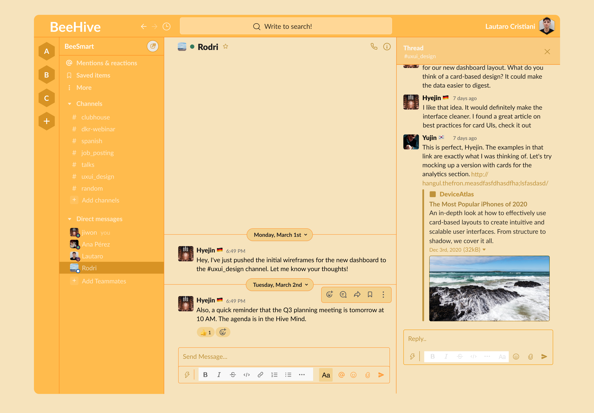

# Beehive - A Modern Landing Page



### ✨ **Live Demo:** [https://your-vercel-link-goes-here.app](https://your-vercel-link-goes-here.app) ✨

---

## 📖 About The Project

Beehive is a fully responsive landing page for a fictional SaaS collaboration platform. This project was built from scratch as a portfolio piece to showcase modern frontend development skills, including a reusable component architecture, responsive design, and subtle animations.

---

## 🚀 Key Features

-   **Fully Responsive Design:** Adapts seamlessly to mobile, tablet, and desktop screens.
-   **Smooth Animations:** Built with `Framer Motion` to provide smooth, on-scroll entrance animations for each section.
-   **Active Section Highlighting:** The navigation bar intelligently highlights the active link based on the user's scroll position, built with `react-intersection-observer`.
-   **Reusable Components:** A scalable architecture using atomic design principles for UI elements.
-   **Modern Tech Stack:** Built with the latest industry-standard tools.

---

## 🛠️ Tech Stack


---

## ⚙️ Getting Started

To get a local copy up and running, follow these simple steps.

### Prerequisites

-   Node.js (v18 or later)
-   npm

### Installation

1.  Clone the repository:
    ```bash
    git clone [https://github.com/lautarocristiani/beehive-landing.git](https://github.com/lautarocristiani/beehive-landing.git)
    ```
2.  Install NPM packages:
    ```bash
    npm install
    ```
3.  Run the development server:
    ```bash
    npm run dev
    ```
4.  Open [http://localhost:3000](http://localhost:3000) with your browser to see the result.